# Pico Pet
A virtual pet that requires the user to complete pomodoros for the health of their pet.

## Hardware
- Raspberry Pi Pico
    - [Raspberry Pi Pico](https://www.raspberrypi.com/products/raspberry-pi-pico/) for development
    - [Waveshare RP2040-Tiny](https://www.waveshare.com/rp2040-tiny.htm) for release
- [Waveshare 1.44" LCD](https://www.waveshare.com/pico-lcd-1.44.htm)
- [DS3231](https://www.amazon.com/dp/B09KPC8JZQ/)
- Any 5v to 3v3 shifter for the DS3231, [for example](https://www.amazon.com/dp/B07LG646VS/)
- Any 5v speaker or buzzer, [for example](https://www.amazon.com/dp/B07P6X9YX7/)
- Any 3v vibrating motor, [for example](https://www.amazon.com/dp/B073YFR5WR)

## NVM Utilization
The NVM (Non-Volatile Memory) module included with the DS3231 provides 4KiB arranged in 512 pages of 8 bytes each.

Permanent storage must be serializable to a specified number of pages, and write to an assigned page address.

Pages are addressed from hexidecimal 0x000 to 0x1ff.

| Page Start | Page End | Module |
| --- | --- | --- |
| 000 | 000 | Header |
| 001 | 001 | Settings |

*note: If the NVM becomes corrupted, try changing the const `NVM_SENTINEL` to force a header guard check failure. This will factory reset the device, and all data will be lost.*
|  | **Header** |
| --- | --- |
| 0 | if set to the `NVM_SENTINEL` value, then the EEPROM is assumed to contain a valid savefile |
| 1 |  |
| 2 |  |
| 3 |  |
| 4 |  |
| 5 |  |
| 6 |  |
| 7 |  |

|  | **Settings** |
| --- | --- |
| 0 | User brightness | 
| 1 | User volume |
| 2 | Pomodoro length in minutes |
| 3 | Short break length in minutes |
| 4 | Long break length in minutes |
| 5 | Cycles, aka number of pomodoros before a long rest |
| 6 |  |
| 7 |  |

## Pin Out

```mermaid
graph LR
    subgraph RP2040
        Pin1
        Pin2
        %%Pin3[GND]
        Pin4
        Pin5
        Pin6
        Pin7
        %%Pin8[GND]
        Pin9
        Pin10
        Pin11
        Pin12
        %%Pin13[GND]
        Pin14
        Pin15
        Pin16
        Pin17
        %%Pin18[GND]
        Pin19
        Pin20
        Pin21
        Pin22
        %%Pin23[GND]
        Pin24
        Pin25
        Pin26
        Pin27
        %%Pin28[GND]
        Pin29
        Pin30
        Pin31
        Pin32
        %%Pin33[GND]
        Pin34
        Pin35
        %%Pin36[3V3_OUT]
        %%Pin37[3V3_EN]
        %%Pin38[GND]
        %%Pin39[VSYS]
        %%Pin40[VBUS]
    end

    subgraph RP2040-Tiny
        TinyPin0
        TinyPin1
        TinyPin2
        TinyPin3
        TinyPin4
        TinyPin5
        TinyPin6
        TinyPin7
        TinyPin8
        TinyPin9
        TinyPin10
        TinyPin11
        TinyPin12
        TinyPin13
        TinyPin14
        TinyPin15
        TinyPin16
        TinyPin17
        TinyPin18
        TinyPin19
        TinyPin20
        %%TinyPin21[3V3]
        %%TinyPin22[GND]
        %%TinyPin23[5V]
    end



    subgraph RTC_NVM
        RTC_SDA
        RTC_SCL
        RTC_SQW
    end
    Pin1[Pin1 I2C0_SDA] --> RTC_SDA
    RTC_SDA --> TinyPin0[TinyPin0 I2C0_SDA]
    Pin2[Pin2 I2C0_SCL] --> RTC_SCL
    RTC_SCL --> TinyPin1[TinyPin1 I2C0_SCL]
    Pin7[Pin7 GP5] --> RTC_SQW
    RTC_SQW --> TinyPin5[TinyPin5 GP5]



    subgraph BUZZER
        SPEAKER
    end
    Pin6[Pin6 PWM_A2] --> SPEAKER
    SPEAKER --> TinyPin4[TinyPin4 PWM_A2]



    subgraph LCD
        LCD_KEY2
        LCD_KEY3
        LCD_DC
        LCD_CS
        LCD_CLK
        LCD_DIN
        LCD_RST
        LCD_BL
        LCD_KEY0
        LCD_KEY1
    end
    Pin4[Pin4 GP2] --> LCD_KEY2
    LCD_KEY2 --> TinyPin2[TinyPin2 GP2]
    Pin5[Pin5 GP3] --> LCD_KEY3
    LCD_KEY3 --> TinyPin3[TinyPin3 GP3]
    Pin11[Pin11 GP8] --> LCD_DC
    LCD_DC --> TinyPin8[TinyPin8 GP8]
    Pin12[Pin12 SPI1_CSn] --> LCD_CS
    LCD_CS --> TinyPin9[TinyPin9 SPI1_CSn]
    Pin14[Pin14 SPI1_SCK] --> LCD_CLK
    LCD_CLK --> TinyPin10[TinyPin10 SPI1_SCK]
    Pin15[Pin15 SPI1_TX] --> LCD_DIN
    LCD_DIN --> TinyPin11[TinyPin11 SPI1_TX]
    Pin16[Pin16 SPI1_RX] --> LCD_RST
    LCD_RST --> TinyPin12[TinyPin12 SPI1_RX]
    Pin17[Pin17 PWM_B6] --> LCD_BL
    LCD_BL --> TinyPin13[TinyPin13 PWM_B6]
    Pin20[Pin20 GP15] --> LCD_KEY0
    LCD_KEY0 --> TinyPin15[TinyPin15 GP15]
    Pin22[Pin22 GP17] --> LCD_KEY1
    LCD_KEY1 --> TinyPin19[TinyPin19 GP29]
```

