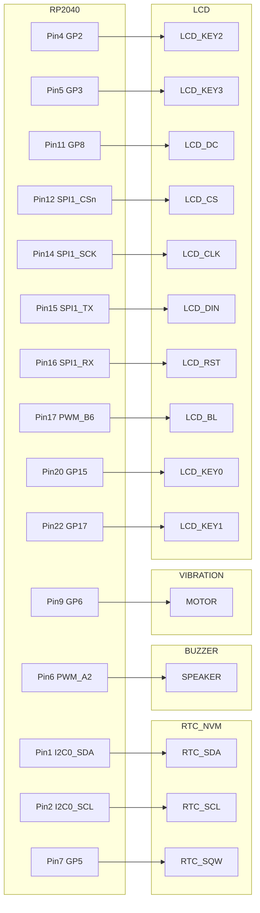
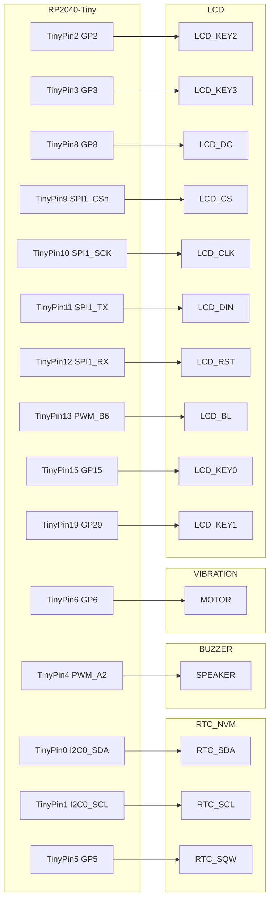

# Pico Pet
A virtual pet that requires the user to complete pomodoros for the health of their pet.

## Hardware
- Raspberry Pi Pico
    - [Raspberry Pi Pico](https://www.raspberrypi.com/products/raspberry-pi-pico/) for development
    - [Waveshare RP2040-Tiny](https://www.waveshare.com/rp2040-tiny.htm) for release
- [Waveshare 1.44" LCD](https://www.waveshare.com/pico-lcd-1.44.htm)
- [DS3231](https://www.amazon.com/dp/B09KPC8JZQ/)
- Any 5v to 3v3 shifter for the DS3231, [for example](https://www.amazon.com/dp/B07LG646VS/)
- Any 5v speaker or buzzer, [for example](https://www.amazon.com/dp/B07P6X9YX7/)
- Any 3v-5v vibrating motor, [for example](https://www.amazon.com/dp/B073YFR5WR)

## NVM Utilization
The NVM (Non-Volatile Memory) module included with the DS3231 provides 4KiB arranged in 512 pages of 8 bytes each.

Permanent storage must be serializable to a specified number of pages, and write to an assigned page address.

Pages are addressed from hexidecimal 0x000 to 0x1ff.

| Page Start | Page End | Module |
| --- | --- | --- |
| 000 | 000 | Header |
| 001 | 002 | Settings |
| 003 | 003 | Inventory |
| 004 | 005 | Pet |

*note: If the NVM becomes corrupted, try changing the const `NVM_SENTINEL` to force a header guard check failure. This will factory reset the device, and all data will be lost.*
|  | **Header** |
| --- | --- |
| 0 | if set to the `NVM_SENTINEL` value, then the EEPROM is assumed to contain a valid savefile |
| 1 |  |
| 2 |  |
| 3 |  |
| 4 |  |
| 5 |  |
| 6 |  |
| 7 |  |

|  | **Settings Page 1** | min | max |
| --- | --- | --- | --- |
| 0 | User brightness | 0 | 15 |
| 1 | User volume | 0 | 4 |
| 2 | *nyi* Vibration enabled | 0 | 1 |
| 3 | *nyi* 12hr clock enabled | 0 | 1 |
| 4 | *nyi* minutes before device sleeps | 1 | 90 |
| 5 |  |  |  |
| 6 |  |  |  |
| 7 |  |  |  |

|  | **Settings Page 2** | min | max |
| --- | --- | --- | --- |
| 0 | Pomodoro length in minutes | 1 | 90 |
| 1 | Short break length in minutes | 1 | 90 |
| 2 | Long break length in minutes | 1 | 90 |
| 3 | Cycles, aka number of pomodoros before a long rest | 1 | 9 |
| 4 | Pet feeding deadline hr | 0 | 23 |
| 5 | Pet feeding deadline min | 0 | 59 |
| 6 |  |  |  |
| 7 |  |  |  |


|  | **Inventory** | min | max |
| --- | --- | --- | --- |
| 0 | Tomatoes | 0 | 99 |
| 1 | Raspberries | 0 | 9 |
| 2 | Lower byte of juice value |  |  |
| 3 | Higher byte of juice value |  |  |
| 4 |  |  |  |
| 5 |  |  |  |
| 6 |  |  |  |
| 7 |  |  |  |

Max juice is 9999ml as a u16

|  | **Pet Page 1** |
| --- | --- |
| 0 | Birth Day |
| 1 | Birth Month |
| 2 | Birth Year |
| 3 |  |
| 4 |  |
| 5 |  |
| 6 |  |
| 7 |  |

|  | **Pet Page 2** |
| --- | --- |
| 0 | Current HP |
| 1 | Sickness |
| 2 | Daily Hunger |
| 3 | Last Fed Day |
| 4 | Last Fed Month |
| 5 | Last Fed Year |
| 6 |  |
| 7 |  |

Max HP = Daily Hunger + 4

Last Fed Year is probably excessive,
but it'd be a weird bug if someone started the pet up after exactly 1 year,
and their pet showed no signs of missed days of hunger...

## Pin Out For Raspberry Pico



## Pinout for Waveshare RP2040-Tiny


## Development Breakboard Build
Below are my recommendations for how to build the development board.

### Shopping List
All amazon links are tracking free and affiliate free; feel free to source these where you wish, but compatability is not guaranteed for other similar products.
The current iteration of the software is absolutely tied to the LCD module below, as well as the combination DS3231 & AT24C32 board.
Theoretically any RTC and NVM module could replace the aformentioned, but the I2C addresses have been set to match the product below.
Additionally, any ST7735S driven 128x128 display could be adapted. All four buttons provided on the waveshare LCD hat are used as well.
- Components
    - Expansion Board https://www.amazon.com/dp/B08X6FPRYF/
    - Breakout Board https://www.amazon.com/dp/B0B982B9HV/
    - Breadboard https://www.amazon.com/dp/B07VFFXPH3/
    - LCD Module https://www.amazon.com/dp/B0957NJP97/
    - Raspberry Pico w/ presoldered headers https://www.amazon.com/dp/B08X7HN2VG/
    - RTC Board https://www.amazon.com/dp/B09KPC8JZQ/
    - Vibrating Motor https://www.amazon.com/dp/B073YFR5WR/
    - Piezo Buzzer https://www.amazon.com/dp/B07P6X9YX7/
- Tools/Resources
    - 22 AWG solid hookup wire https://www.amazon.com/dp/B07TX6BX47/
    - 22 AWG wire stripper https://www.amazon.com/dp/B06X9875Z7/
    - CR2032 battery https://www.amazon.com/dp/B071D4DKTZ/
    - Command strip https://www.amazon.com/dp/B07P32RHQ4/

### Assembly
1. Socket the Raspberry Pico into center of the Expansion Board.
2. Socket the LCD Module into the left slot of the Expansion Board.
3. Using a command strip, attach the breadboard to the flat side of the breakout board.
    - The 1A point of the breadboard should be in the top left, near where the word VBUS is printed on the back of the breakout board.
    - While many breadboards do come with stickers, there is often no solid insulating layer for the conductive rails, and the breakout board has sharp solder points that can stab through this thin soft layer. Whatever you do, I recommend insulating these two boards or you will risk a short...
4. Connect the breakout terminal VSYS and tie point 1A on the breadboard, preferably using a red wire.
    - I recommend running this wire over the top of the board rather than the side as it would be natural to do, because there will be essentially no space between the Raspberry Pico and this specific Breakout Board when they are eventually mated.
5. Connect the breakout terminal GND (the one adjacent to VSYS) and tie point 2A on the breadboard, preferably using a black wire.
    - Again, I recommend running this wire over the top of the board.
6. Connect the data lines to the breadboard, this time allowing the wires to wrap around the side of the board (recommended colors in parenthesis):
    - GP0 to J1 (green)
    - GP1 to J2 (white)
    - GP4 to J5 (yellow)
    - GP5 to J6 (blue)
    - GP6 to J7 (green)
7. Connect new lines on the breadboard for the RTC module:
    - C2 to C3 (black)
    - D1 to D4 (red)
    - H1 to B5 (green)
    - H2 to B6 (white)
    - H6 to B7 (blue) (I recommend routing this cable up then following the other 2 data lines)
8. Connect new lines on the breadboard for the piezo buzzer:
    - G5 to F17 (orange)
    - E2 to G13 (black) (I recommend routing this along the top side, then down the gap I left in the I column)
9. Connect new lines on the breadboard for the vibration motor:
    - G7 to K16 (green)
    - F13 to F15 (black)
10. Stick the vibration motor onto the bottom of the breadboard.
11. Attach the vibration motor wires (letting the wires lay to the right):
    - red wire to G16
    - blue wire to G15
12. Place the piezo buzzer onto pins J17 and J13 (placement will secure the vibration motor wires)
13. Insert a CR2032 battery into the RTC module.
14. Place the RTC module onto pins A3, A4, A5, A6, A7, and A8.
15. Finally, socket the breakout board onto the right slot of the Expansion Board.

### Development Environment Setup
#### NixOS
I recommend running the following to open the VSCodium development environment:
```bash
nix develop --command codium .
```

You can of course just use whatever text editor you like, and simply enter the flake in a terminal with:
```bash
nix develop
```

#### Other Linux Distros
You'll need Rust installed and set to nightly-2023-11-16. Other versions may not be supported. You will likely also need udev to detect the raspberry pico. To use the makefile, you'll also want gnu make. You can review the `flake.nix` and attempt to reproduce it in your own OS.

### First Time Setup
Your first time opening this repo, you'll need to setup the dependencies and enable the thumbv6m-none-eabi target. This has been automated for you:
```bash
make init
```

### Running The Code
The build process performs a number of actions. The sprites will be converted from PNG files to raw binary files containing RGB332 data. Fonts will be converted from PNG files to binary files containg black&white data. The custom PEAT audio files will be converted from plaintext files to the binary custom BEAT format. With all assets converted, the project will finally build and attempt to upload.

All of this is as simple as invoking:
```bash
make run
```

## Attributions
Placeholder artwork (lofi.png) copyright belongs to Juan Pablo Machado.
