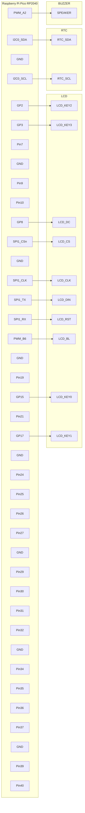

# Pico Pet

## Pin Out

```mermaid
flowchart LR
    subgraph Raspberry Pi Pico RP2040
        Pin1
        Pin2
        Pin3[GND]
        Pin4
        Pin5
        Pin6
        Pin7
        Pin8[GND]
        Pin9
        Pin10
        Pin11
        Pin12
        Pin13[GND]
        Pin14
        Pin15
        Pin16
        Pin17
        Pin18[GND]
        Pin19
        Pin20
        Pin21
        Pin22
        Pin23[GND]
        Pin24
        Pin25
        Pin26
        Pin27
        Pin28[GND]
        Pin29
        Pin30
        Pin31
        Pin32
        Pin33[GND]
        Pin34
        Pin35
        Pin36
        Pin37
        Pin38[GND]
        Pin39
        Pin40
    end


    subgraph LCD
        LCD_KEY2
        LCD_KEY3
        LCD_DC
        LCD_CS
        LCD_CLK
        LCD_DIN
        LCD_RST
        LCD_BL
        LCD_KEY0
        LCD_KEY1
    end
    Pin4[GP2] --> LCD_KEY2
    Pin5[GP3] --> LCD_KEY3
    Pin11[GP8] --> LCD_DC
    Pin12[SPI1_CSn] --> LCD_CS
    Pin14[SPI1_CLK] --> LCD_CLK
    Pin15[SPI1_TX] --> LCD_DIN
    Pin16[SPI1_RX] --> LCD_RST
    Pin17[PWM_B6] --> LCD_BL
    Pin20[GP15] --> LCD_KEY0
    Pin22[GP17] --> LCD_KEY1


    subgraph RTC
        RTC_SDA
        RTC_SCL
    end
    Pin1[I2C0_SDA] --> RTC_SDA
    Pin2[I2C0_SCL] --> RTC_SCL


    subgraph BUZZER
        SPEAKER
    end
    Pin6[PWM_A2] --> SPEAKER
```
